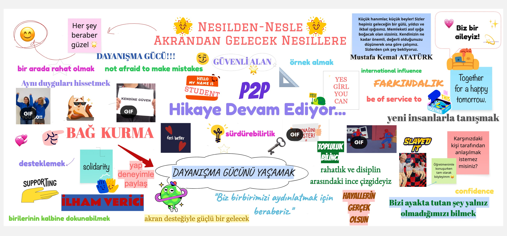

# Initial Coding of Cover Story transcript: Tutees

**<Öykü>** My first question to you, young people, is this: What kind of educational platform does this cover represent? When you look at this cover, what type of educational approach do you understand from it? Let's start with Sümeyye.

**<Sümeyye>** I think it shows a learning platform that is both sustainable and built on togetherness and sincerity <mark>{Belonging & Family-Like Community}</mark>. It suggests a teacher–student relationship based on forming a bond <mark>{Friendly & Balanced Tutor Interaction; Belonging & Family-Like Community}</mark>. It also shows teachers as role models—so much so that students would want to become like them in the future <mark>{Role Model & Aspirational Tutors}</mark>. I’d describe it as inspiring, understanding, and supportive <mark>{Friendly & Balanced Tutor Interaction; Motivation & Engagement}</mark>.

**<Esmanur>** I think it’s not an authoritarian model. It’s an environment based on understanding and sincerity <mark>{Friendly & Balanced Tutor Interaction; Psychological Safety}</mark>. By “not putting pressure,” I mean this: before learning the subject, we build a personal connection with the teacher <mark>{Belonging & Family-Like Community}</mark>, and we can even see them as an ideal for ourselves <mark>{Role Model & Aspirational Tutors}</mark>. For example, the teacher I’m learning from works at the university I want to attend—teaching students there—so that motivates me a lot <mark>{Motivation & Engagement}</mark>. It feels like I’m learning with someone who is already part of the world I want to reach <mark>{Role Model & Aspirational Tutors}</mark>.

**<Ender>** Looking at this magazine cover, what I take from it is realizing how valuable it is to meet new people, build bonds, and do something together <mark>{Social Dimension}</mark>. We weren’t just studying. We truly became like a family <mark>{Belonging & Family-Like Community}</mark>. When we didn’t meet for a long time, we missed each other. We had so much to talk about <mark>{Social Dimension; Belonging & Family-Like Community}</mark>.

**<Ada>** For me, this cover shows that it wasn’t only lesson-focused with our teachers. There was emotional support too—an emotional bond and solidarity <mark>{Belonging & Family-Like Community; Shared Identity & Solidarity}</mark>. During this process, we were never left alone, and I think we’re very lucky for that <mark>{Belonging & Family-Like Community}</mark>. Also, like someone else said: my teacher does the profession I want. Learning from them helps me understand how to progress in that profession and how I can shape my own future <mark>{Role Model & Aspirational Tutors}</mark>. That makes me happy.

**<Başak>** When I look at this cover, I see a warm, sincere family atmosphere <mark>{Belonging & Family-Like Community}</mark>. I see trust, love, and respect <mark>{Friendly & Balanced Tutor Interaction; Psychological Safety}</mark>.

**<Öykü>** If there’s nothing else to add, I want to ask this: a title was chosen—“from generation to generation, from peers to future generations”—and there is also a headline saying “the peer-to-peer story continues.” Why did you choose these? Why did you decide on these phrases? I’m curious. Let’s start again with Sümeyye.

**<Sümeyye>** Like the title says, “from generation to generation”—this is something that will continue. It will be a platform that university students continue in the future. So it’s sustainable <mark>{Generational Reciprocity}</mark>. And speaking for myself—and probably my friends too—one of the things I want most when I grow up is to do something like this <mark>{Generational Reciprocity}</mark>. Because you get to touch someone’s life, and continuing that is truly beautiful.

**<Esmanur>** I think one reason we wrote it that way was to attract attention. After all, this program and the work you’re doing have no limits <mark>{Transformation of Traditional Education}</mark>, and I think that inspires people even more <mark>{Motivation & Engagement}</mark>.

**<Ender>** I want to speak about what “P2P” means, because no one said it explicitly. We used “peer to peer” as “from peer to peer.” When we said “the story continues” and “from generation to generation,” we wanted to express this: right now, we’re learning from peers who are older than us—more experienced peers—who are helping us <mark>{Age Proximity Advantage}</mark>. But when we become as experienced as they are, we want to help others the way they helped us <mark>{Generational Reciprocity}</mark>. That’s why we expressed it as “from generation to generation.”

**<Ada>** I also want to add something about the title. “From generation to generation” means both helping each other and passing on what our teachers taught us <mark>{Generational Reciprocity}</mark>. In the future, when children need help—or knowledge—we’ll be able to pass it on to them <mark>{Generational Reciprocity}</mark>. And it shows that there is hope in everything. I used to say I was very unsocial, like I had no hope I would socialize. But my teachers gave me hope and showed me that goodness hasn’t disappeared <mark>{Boosted Self-Confidence}</mark>. We came out of the earthquake, and in our hardest time they stood by us and made us feel we weren’t alone <mark>{Shared Identity & Solidarity; Belonging & Family-Like Community}</mark>. That was really meaningful.

**<Başak>** When we say “the story continues,” I think it means this is only the beginning. And “from generation to generation” means: our teachers are teaching us now. If I apply to such a platform later, I will teach those children <mark>{Generational Reciprocity}</mark>. Then they'll teach others, and so on.

**<Öykü>** I’ll ask about the things you added to the cover. You don’t have to mention everything—just something you added and loved, or something someone else added that you really liked. Let’s start with Sümeyye again.

**<Sümeyye>** One thing I really liked was "not being afraid to make mistakes" <mark>{Psychological Safety}</mark>. After the earthquake, many of us were psychologically affected. Adjusting to a new place, new classrooms, or even attending lessons in those classrooms again—it really required significant psychological resilience <mark>{Shared Identity & Solidarity}</mark>. This program helped break down that prejudice for me. I was very afraid to speak up in class—very afraid of making mistakes. But through this experience, my self-confidence grew <mark>{Boosted Self-Confidence}</mark>. Now I’m not afraid of making mistakes—because what matters is learning <mark>{Psychological Safety}</mark>.

One thing that stood out to me was that we were together to enlighten each other. Sometimes teachers helped a lot, but sometimes students understood each other better. We could explain things in ways we ourselves didn’t even realize. Ender would explain a question one way, Ada another way, and we learned the same information differently <mark>{Interactive & Efficient Learning Environment}</mark>. I also wanted to mention Gizem teacher and the cat corner, because she loves animals and her cats would pass by during live classes—it was very sweet <mark>{Friendly & Balanced Tutor Interaction}</mark>. Another thing was that lessons were disciplined but not overwhelming. Sometimes after intense days, we played educational math games or just chatted <mark>{Friendly & Balanced Tutor Interaction; Interactive & Efficient Learning Environment}</mark>. We even had drawing assignments. Usually Ela drew the pictures. Our friendships grew stronger, we became more social, and met different people like us <mark>{Social Dimension}</mark>. I’m very happy to have met all of you. Thank you.

**<Öykü>** Thank you, Sümeyye, you explained it beautifully. Meeting so many people, maybe one day your universities or departments will coincide—you never know. Thank you. Now I’ll give the floor to Esmanur.

**<Esmanur>** Two things I loved: the green globe — it shows this won’t stay small, it can grow worldwide <mark>{Global Interaction Opportunities}</mark>. And Atatürk’s quote: “The most important battle is the one against ignorance.” Having such a valuable statement on a project like this felt very meaningful.

**<Ender>** One of the things I liked most was "Don't you want to be understood by the person in front of you?" Because both our friends and our teachers were always very understanding <mark>{Friendly & Balanced Tutor Interaction; Psychological Safety}</mark>. We were already going through a hard time—we had all experienced a natural disaster <mark>{Shared Identity & Solidarity}</mark>. I remember that even after lessons started, the aftershocks hadn’t ended. One day there was an earthquake while we were in class. If we hadn’t been in that lesson at that moment, the psychological impact would have been much worse. Being in class was a big advantage for us <mark>{Shared Identity & Solidarity; Psychological Safety}</mark>.

Also, there’s a ruler on the cover—because our shared focus was math. I used to hate math. I hated it with everything I had. But now I can solve math questions <mark>{Motivation & Engagement}</mark>. So it didn’t only help us psychologically; it also helped academically. And the story continuing from generation to generation is beautiful, because others should also have this chance <mark>{Generational Reciprocity}</mark>.

**<Ada>** The phrases I liked most were: “We are on the thin line between comfort and discipline.” Because it shows the environment wasn’t too strict, but also wasn’t completely careless. There was balance: we could express ourselves comfortably, but there was also order and discipline <mark>{Friendly & Balanced Tutor Interaction}</mark>.

Also, "What keeps us standing is knowing we're not alone." <mark>{Shared Identity & Solidarity}</mark> Because after the earthquake, I think the fear we all experienced—this phrase captures it authentically. Having someone by your side during your most difficult moments is very comforting and makes you feel safe <mark>{Shared Identity & Solidarity; Psychological Safety; Belonging & Family-Like Community}</mark>. This sentence speaks to overcoming the feeling of loneliness. I really liked both of these.

**<Başak>** One of the phrases I loved most is the Atatürk quote. Because if he hadn't existed, we wouldn't be able to speak freely on this platform. And I think we can be one of the greatest examples of "from generation to generation." <mark>{Generational Reciprocity}</mark> During the earthquake period, I first met everyone here. We were together in 8th grade. Then my sister Yağmur joined, and hopefully my other sisters will join in the future too.

**<Öykü>** I want to ask you something, Başak. You added the Spiderman photo—why?

**<Başak>** One of the main reasons I added Spider-Man is that in the classes I attended, my friends and I—we were all brought together by experiencing the same disaster, the same problem. So, I entered a "Spiderman mood" (referring to the meme of Spidermen pointing at each other, signifying sameness/solidarity) <mark>{Shared Identity & Solidarity}</mark>.

**<Öykü>** So you met people similar to yourself.

**<Başak>** Yes.

**<Öykü>**  Now moving toward the conclusion. What does this platform make you feel, what is the most important thing for you, and in what way did it help you? Let’s start with Ada.

**<Ada>** For me, this platform is the combination of mutual help, solidarity, and hope <mark>{Shared Identity & Solidarity}</mark>. It definitely makes me feel safe. I added "safe space" for a reason. It makes me feel understood by our tutors and that they value us <mark>{Psychological Safety}</mark>. Feeling understood and valued—and realizing that together we can be stronger <mark>{Boosted Self-Confidence}</mark>. It makes me feel stronger. It represents post-earthquake solidarity and healing together <mark>{Shared Identity & Solidarity}</mark>.

**<Başak>** One of the most important things was feeling comfortable. I could talk freely with teachers and friends, knowing I wouldn’t be judged <mark>{Psychological Safety; Improved Communication}</mark>. It gave me trust and a sense of family <mark>{Belonging & Family-Like Community}</mark>.

**<Sümeyye>** When I look at this, I feel peace and safety, because there’s an energy that stood by me during one of the hardest times of my life <mark>{Psychological Safety; Shared Identity & Solidarity}</mark>.

**<Esmanur>** For me it definitely gives a sense of belonging. My teacher has gone beyond “teacher” for me—more like an older sister <mark>{Age Proximity Advantage}</mark>. We became like a family <mark>{Belonging & Family-Like Community; Friendly & Balanced Tutor Interaction}</mark>. Even after math lessons ended, mentoring continued, which I loved. It didn’t end with the earthquake project—it became something voluntary and ongoing. Thank you so much.

**<Öykü>** Thank you. You all summarized it beautifully. I just want to ask one thing: why is there a key? 

**<Sümeyye>** I see the key as the symbol of this program starting everything. It opens doors and breaks prejudices <mark>{Transformation of Traditional Education}</mark>. It represents solving problems and opening different doors together, with different keys.

**<Öykü>** Finally, what would be the most challenging part of this platform? What would be the hardest or most unexpected difficulty? Let’s start with Ender.

**<Ender>** Accessibility to lessons—our internet connections aren’t always as they should be. In our region, especially in Southeastern Anatolia, internet problems are common <mark>{Online Learning Barriers}</mark>.

**<Ada>** Another challenge could be that everyone’s experiences are different, so you can’t approach everyone in the same way <mark>{Flexible, Personalized Learning}</mark>. And building a safe, trusting environment can be hard <mark>{Psychological Safety}</mark>.

**<Esmanur>** Not everyone has the same opportunities or environment to participate <mark>{Online Learning Barriers}</mark>, and scheduling can be difficult <mark>{Scheduling Conflicts}</mark>.

**<Başak>** Screen-based education. Not being physically together makes it harder to read expressions <mark>{Lack of Emotional Connection}</mark>.

**<Sümeyye>** Fatigue and lack of focus <mark>{Digital Engagement Challenges}</mark>. Time conflicts and life events can also make it difficult sometimes <mark>{Scheduling Conflicts}</mark>.